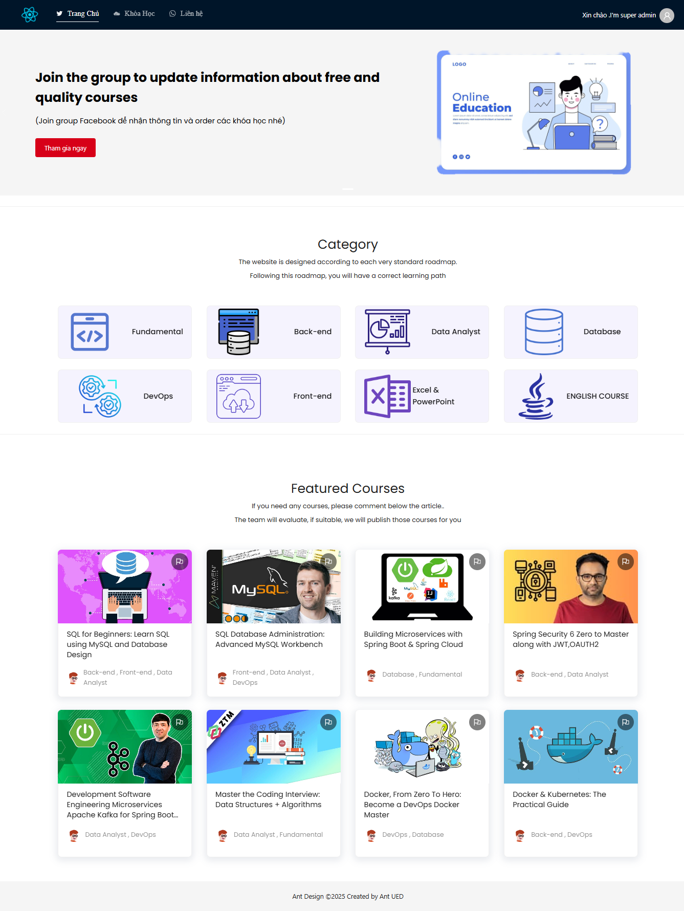
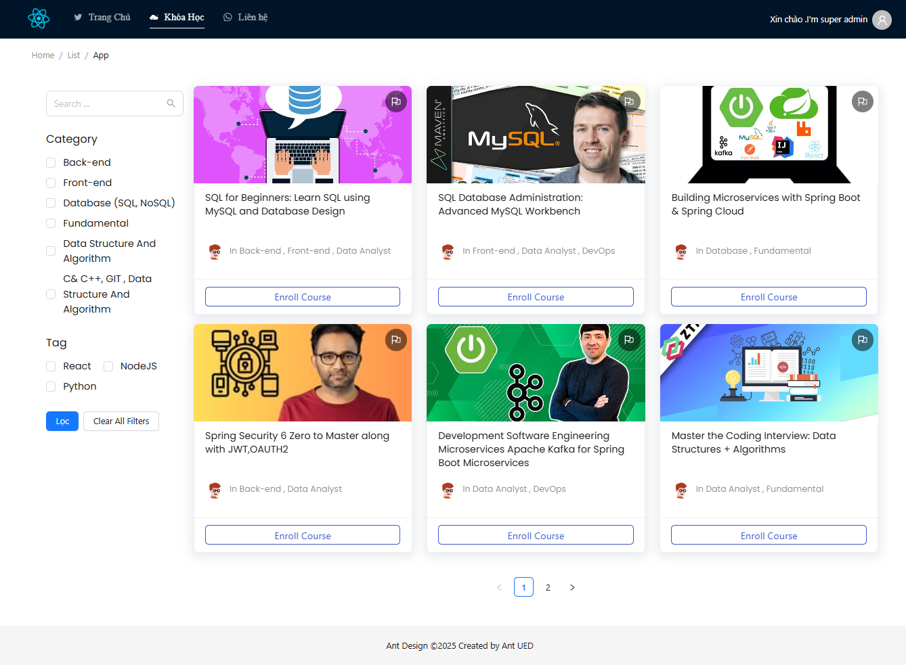
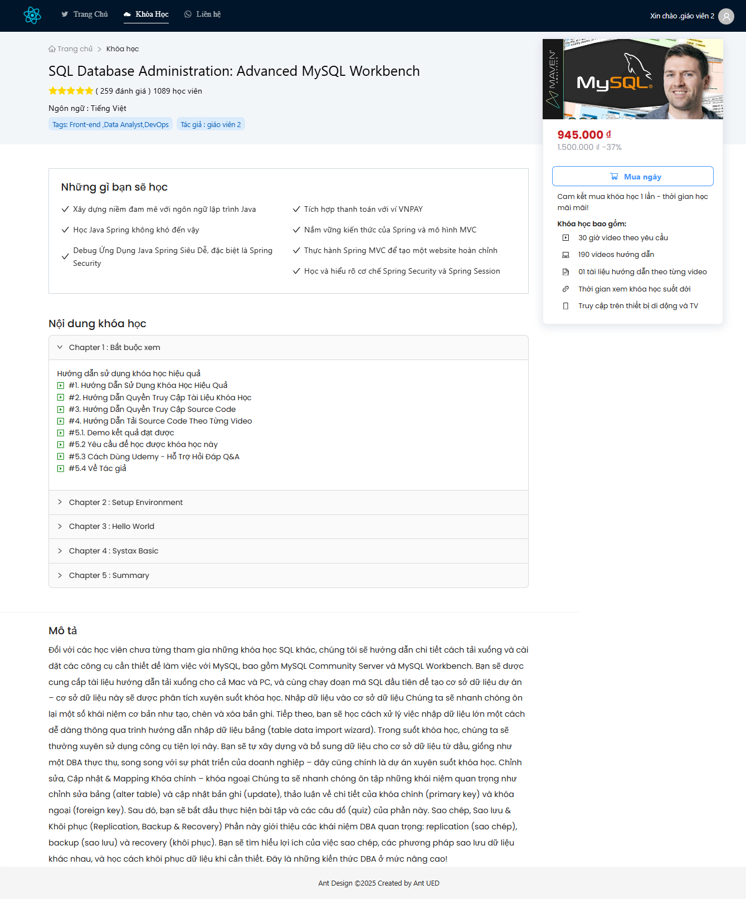
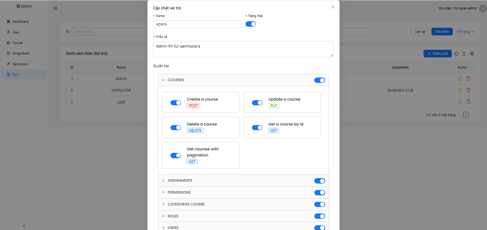

# 📚 Learning Management System (LMS)

Ứng dụng web full-stack quản lý khóa học và theo dõi việc ghi danh của sinh viên.  
Backend sử dụng **Spring Boot**, Frontend sử dụng **ReactJS**.

- ⚠️ Lưu ý: Repository này chỉ chứa frontend.  
  Backend (**learning-management-system-java**) cần chạy để frontend hoạt động đúng.

---

## ✨ Tính năng chính

- **Xác thực & Phân quyền**
  - Đăng nhập dựa trên JWT
  - Quản lý Role & Permission chi tiết (Admin, Instructor, Student)
- **Quản lý khóa học**
  - CRUD khóa học, phân trang, tìm kiếm theo từ khóa
  - Upload thumbnail cho khóa học
- **Quản lý Assignment & Submission**
  - Giảng viên tạo, chỉnh sửa và xoá assignment cho từng khóa học
  - Sinh viên nộp bài (submission) trực tuyến
  - Admin/Instructors xem, chấm điểm và phản hồi bài nộp
- **Theo dõi ghi danh**
  - Sinh viên có thể ghi danh và xem danh sách khóa học đã đăng ký
- **Bảng điều khiển Admin**
  - Quản lý người dùng và khóa học đầy đủ (CRUD)
  - Phân quyền chi tiết, gán khóa học cho người dùng

---

## 🛠️ Công nghệ sử dụng

| Layer        | Công nghệ                                                  |
| ------------ | ---------------------------------------------------------- |
| **Backend**  | Spring Boot, Spring Data JPA, Spring Security (JWT), Maven |
| **Frontend** | ReactJS, Ant Design                                        |
| **Database** | MySQL                                                      |
| **Khác**     | RESTful API                                                |

🖼️ Ảnh minh họa

### Trang chủ

### Trang danh sách khóa học

### Trang chi tiết khóa học

### Trang quản trị – Cập nhật quyền (Permissions)

